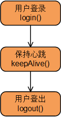

#**eSDK TP NATIVE SDK**#
华为eSDK提供的*eSDK TP NATIVE SDK*可以快速为合作伙伴提供统一账号管理、视频会议调度、会议控制等业务能力。

##版本信息##
*V2.1.00*

##开发环境##
- 操作系统： Windows7专业版
- Microsoft Visual Studio：Visual Studio 2010专业版

##文档指引##
- src文件夹：包含*TP NATIVE SDK*的源代码文件
- sample文件夹：包含*eSDK*提供的场景话展示样例
- doc：包含*eSDK*提供的开发指引文档

##入门指引##
在开始阅读本章节，请至[远程实验室](http://developer.huawei.com/cn/ict/remotelab)企业云通信（EC）的调测环境，以方便后续操作。
###接入视讯系统###

* 业务流程图

  

* 流程说明

  1. 第三方应用程序（Application）调用`login`接口向`eSDK TP Server`请求登录，并携带有用户名和密码。`eSDK TP Server`返回登录结果。
  2. 每隔一段时间(不多余60s，建议20s)，第三方应用程序调用`keepAlive`接口向`eSDK TP Server`请求保活。
  3. 在调用完所有业务接口后，第三方应用程序调用`logout`接口向`eSDK TP Server`请求登出。


* 前提条件

  * `eSDK TP Server`上的SMC服务已正确配置并启用，并已获取*eSDK TP*服务地址、端口、账号、密码。*eSDK TP*安装配置过程及结果验证请参考《eSDK TP V100R005C70 安装配置指南》。
  * 已获取*eSDK TP SDK*软件包。

* 实现说明

  步骤1.  用户登录

  ```
  //cpp code
  int ret = TP_E_RET_CODE_FAIL;
  //登录
  ret = login("esdk_user","Huawei@123");//登录的账号和密码请向eSDK TP Server管理员索取。

  if (TP_E_RET_CODE_SUCCESS == ret){
      AfxMessageBox("登录成功");
      SetTimer(1, 19000, NULL);  //启动保活定时器
  }
  else{
      char result[1024]={0};
      sprintf_s(result, 1023, "登录失败； 返回码 ：%d",ret);
      AfxMessageBox(result);
  }
  ```

  步骤2.  保持心跳

  ```
  //cpp code
  //保活
  int ret = keepAlive();
  ```

  步骤3.  用户登出

  ```
  //cpp code
  //等待保活进程结束
  StopMsgRetrieval();
  //停止保活定时器
  KillTimer(1);
  int ret = TP_E_RET_CODE_FAIL;
  //登出
  ret = logout();
  if (TP_E_RET_CODE_SUCCESS == ret){
      AfxMessageBox("登出成功");
  }
  else{
      char result[1024]={0};
      sprintf_s(result, 1023, "登出失败； 返回码 ：%d",ret);
      AfxMessageBox(result);
  }
  ```

  ---结束

*详细介绍请参考doc中的[《开发指南》*

### 获取帮助 ###

在开发过程中，您有任何问题均可以至[DevCenter](https://devcenter.huawei.com)中提单跟踪。也可以在[华为开发者社区](http://bbs.csdn.net/forums/hwucdeveloper)中查找或提问。另外，华为技术支持热线电话：400-822-9999（转二次开发）


